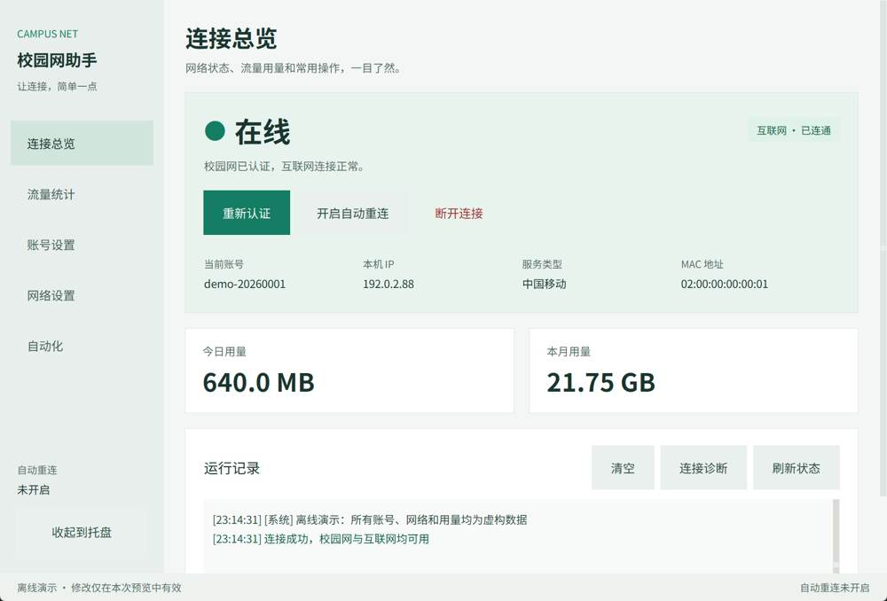

# CampusNet · 校园网助手

面向梧州学院 Dr.COM 门户的 Windows 桌面客户端，提供登录、断开、自动重连、网络诊断和本机流量估算。运行时只依赖 Python 标准库与 Tkinter，也可构建单文件程序。

当前版本：2026.09.24.1。本项目以 [MIT 许可证](LICENSE)开源；发布准备过程见 [发布准备](docs/release-readiness.md)。

本地预览可双击 preview-ui.bat：优先运行本次构建的离线演示，没有本地构建时从源码启动。自行构建的产物位于 dist，验收产物单独放在 .artifacts/dist。

## 新界面

- 默认 1180×800 逻辑像素，按 DPI 缩放并约束到显示器工作区；小窗口可滚动访问完整内容。
- 中文无衬线字体、12pt 正文、清楚的文字层级；雾白底色、白色卡片和青绿色主操作。
- 48px 输入区域、26px 勾选指示和大尺寸按钮；支持 Tab、Enter、Space、Alt+1…5 切页、Ctrl+S 保存。
- 五个页面：连接总览、流量统计、账号设置、网络设置、自动化。
- 保存成功/失败和未保存状态直接显示在页面内；无效输入定位到具体字段。

审查、目标及验证记录见 [GUI 审查与方案](docs/gui-review-and-plan.md)。

## 启动

Windows 桌面，开发目标 Python 3.11–3.13（需包含 Tkinter）：

~~~powershell
python campus_gui.py
# 离线演示：虚构账号与用量，不访问认证服务或个人配置
python campus_gui.py --demo
# 显式最小化到托盘
python campus_gui.py --minimized
~~~

首次使用在“账号设置”填写账号、密码、服务类型并保存，在“网络设置”确认校园网配置名。默认只在 WZXY-Student 且认证路由匹配时发起认证；其他网络显示等待。

自动重连不会主动隐藏窗口。使用“收起到托盘”隐藏；守护运行时关闭窗口会收起到托盘，真正退出使用托盘菜单。设置中可配置 Windows 开机启动、下次启动自动登录或自动重连。

字体从系统已安装的 Noto Sans SC、思源黑体、微软雅黑 UI 等选择；不分发字体。若希望进一步放大，可在 PowerShell 设置后启动：

~~~powershell
$env:CAMPUS_UI_SCALE = "1.25"
python campus_gui.py
~~~

缩放值支持 0.5–3.0。DPI 在启动时确定，跨不同 DPI 显示器移动后建议重新启动。

## 配置与隐私

- 源码运行使用项目目录的 campus_login.json；独立程序使用程序所在目录的同名文件。
- “自动化”页面显示实际配置位置，并提供复制按钮。示例配置为 campus_login.example.json。
- 账号密码明文保存，现有门户协议可能通过 HTTP 发送凭据；请阅读 [安全说明](SECURITY.md)。
- 流量历史保存在同目录 campus_traffic.json，源码和独立程序分别记录。配置、流量与构建产物均被 Git 忽略。
- 分享时只复制新构建的程序及发布文档，不要打包包含个人配置的整个运行目录。

## 流量统计口径

本机只读取通往认证服务器的已识别网卡，默认每 5 秒采样。首次读取、换接口或计数器回退时重建基线；后续读取相减，记录到采样时刻所在日期。每日明细最多保留 400 天，累计总量单独保留。

当前实现会保存并复用基线，若网卡计数器持续有效，再次启动时可能把两次采样之间的流量一起计入。不能严格分离程序关闭或暂停采样期间的流量，也不能把结果视为学校计费值。服务端会话另列为参考，部分部署不提供有效流量读数。

## 命令行

~~~powershell
python campus_login.py login
python campus_login.py status
python campus_login.py test
python campus_login.py watch
python campus_login.py logout
python campus_login.py set
python campus_login.py traffic --days 14
~~~

详细参数使用 --help。认证和注销始终受校园网识别约束。协议背景见 [协议参考](docs/protocol.md)。

## 开发与构建

~~~powershell
python -m venv .venv
.venv/Scripts/python.exe -m pip install -r requirements-build.txt
./build.bat
~~~

默认产物为 dist/CampusNet.exe。已有程序正在运行时，可用独立目录构建：

~~~powershell
./build.bat --distpath .artifacts/dist --workpath .artifacts/build
./.artifacts/dist/CampusNet.exe --self-test .artifacts/self-test.json
~~~

构建脚本先测试；解释器依次来自 CAMPUS_PYTHON、项目 .venv、PATH。

~~~powershell
python -m unittest discover -s tests -v
$env:CAMPUS_GUI_TESTS = "1"
python -m unittest discover -s tests -v
~~~

GUI 用例需要桌面。--demo 和 --self-test 在创建 App 前替换网络、注册表、配置与统计入口，使用临时目录，结束后清理。CI 配置在 .github/workflows/ci.yml；尚未连接远端时不代表已通过云端运行。

## 项目导航

- [开发架构与检查](docs/development.md)
- [贡献指南](CONTRIBUTING.md)
- [变更记录](CHANGELOG.md)
- [第三方材料说明](THIRD_PARTY_NOTICES.md)
- [发布准备记录](docs/release-readiness.md)
- [门户研究笔记](docs/research/)

历史笔记保存在 docs/history；门户抓取快照（reference/）因第三方授权未确认，不随仓库分发，仅分析结论公开于 docs/research/。

## 许可证

本项目以 [MIT 许可证](LICENSE) 开源。reference/ 目录等第三方材料不适用本许可证，详见 [THIRD_PARTY_NOTICES.md](THIRD_PARTY_NOTICES.md)。
